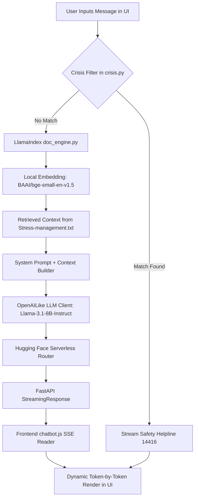

# Peace Talk - Comprehensive Interview Preparation Guide

This guide is designed to help you explain the **Peace Talk** chatbot project in-depth during interviews. It covers the core architecture, technical design decisions, code implementation details, a system workflow diagram, and answers to challenging technical questions.

---

## 🚀 1. The Elevator Pitch
> *"Peace Talk is an AI-powered, empathetic mental health companion. It uses a **Hybrid Retrieval-Augmented Generation (RAG)** pipeline to provide supportive stress management conversations. To build this, I developed a lightweight backend using **FastAPI** and **LlamaIndex** that streams responses in real-time. I also implemented a **local safety firewall** that immediately intercepts crisis keywords and redirects users to active national help resources, bypassing the LLM entirely for critical safety scenarios. The frontend is a modern, responsive web application utilizing glassmorphism styling and SSE streaming."*

---

## 🏗️ 2. Architectural Overview



### Key Technical Pillars

1.  **Hybrid RAG Architecture**:
    *   **Local Embeddings**: `BAAI/bge-small-en-v1.5` loaded locally in-memory via `sentence-transformers`. This removes the network overhead and potential rate limits of remote embedding APIs.
    *   **Remote LLM**: `Meta-Llama-3.1-8B-Instruct` queried via Hugging Face's serverless router. This keeps the resource footprint on the hosting machine extremely small while utilizing a powerful 8-billion parameter state-of-the-art model.
2.  **FastAPI Async Streaming**:
    *   Uses FastAPI’s `StreamingResponse` to push tokens to the frontend as soon as they are generated by the LLM.
    *   Uses Server-Sent Events (SSE) formatting (`data: {...}\n\n`) to deliver structured JSON packages.
3.  **Local Firewall / Crisis Intercept**:
    *   Processes queries locally inside a lightweight list scanner to detect self-harm or high-stress markers.
    *   If a match is found, the system halts the LLM query entirely and streams a pre-compiled resource block containing the **Govt of India's 24/7 helpline (14416)**. This enforces strict safety parameters and saves token costs.

---

## 💻 3. Deep Dive into the Codebase

### A. The RAG Pipeline (`doc_engine.py`)
This file is the core intelligence layer using LlamaIndex:
*   **Vector Database Init**: SimpleDirectoryReader reads from the `data/` directory. The local embedding model embeds the text and saves it in a `VectorStoreIndex`.
*   **OpenAI-Compatible wrapper for Hugging Face**:
    ```python
    llm = OpenAILike(
        model="meta-llama/Llama-3.1-8B-Instruct",
        api_base="https://router.huggingface.co/v1",
        api_key=HF_API_KEY,
        is_chat_model=True
    )
    ```
    This enables us to use the standard, highly-optimized OpenAI client libraries while targeting Hugging Face's free/serverless router endpoints.
*   **Prompt Engineering**: We override LlamaIndex's default QA prompt template to instruct the model to behave as an empathetic support assistant.

### B. The API Server (`main.py`)
This is the FastAPI gateway:
*   Checks for crisis keywords using `contains_crisis_keywords(user_input)`.
*   Spawns `event_generator()` to asynchronously stream text chunks retrieved by `query_documents_stream(user_input)` from the LlamaIndex query engine.
*   Yields data formatted for standard EventSource parsing.

### C. The Frontend (`chatbot.js` & `styles.css`)
*   **Dynamic Theme System**: Stores light/dark choices in `localStorage` and applies dynamic CSS variables to root elements (`data-theme`).
*   **Typing Effect**: Uses the browser's `fetch` API and `response.body.getReader()` to decode stream buffers sequentially and updates the chatbot message bubble dynamically.

---

## 💬 4. Common Interview Questions & Answers

### Q1: Why did you use LlamaIndex instead of LangChain for the document retrieval?
**Answer**:
*   *LlamaIndex is purpose-built for search, retrieval, and indexing. It provides cleaner, out-of-the-box abstractions like `SimpleDirectoryReader` and `VectorStoreIndex` which make building a RAG pipeline faster and highly performant.*
*   *For memory-based, general multi-step chain orchestration, I also explored LangChain (implemented in `chat_engine.py`), but for querying static stress-management documents, LlamaIndex was the more optimized tool.*

### Q2: Why did you use a local embedding model instead of a remote API?
**Answer**:
*   *Remote embedding endpoints (like Hugging Face's hosted inference) are subject to network failures, latency, and API rate-limiting. Since the embedding model (`BAAI/bge-small-en-v1.5`) is extremely lightweight (~100MB), running it locally via `sentence-transformers` gives us sub-millisecond local encoding times, runs on standard CPUs, and works completely offline/independently of external embedding APIs.*

### Q3: How does your crisis detection system work, and why is it structured this way?
**Answer**:
*   *The crisis keyword filter uses local string scanning in `crisis.py`. We intercept safety-critical messages before sending them to the LLM for two reasons:*
    1.  **Safety**: *LLMs can sometimes hallucinate or give inappropriate advice during a self-harm crisis. By hardcoding a supportive, verified helpline message (Govt of India's 14416 initiative), we ensure absolute reliability.*
    2.  **Resource Optimization**: *It bypasses the LLM query entirely, saving API token costs and computing resources.*

### Q4: How would you scale this system to support 10,000 PDF documents?
**Answer**:
*   *Currently, the index is loaded into local RAM using LlamaIndex's default in-memory vector store. To scale this:*
    1.  **Vector DB**: *I would migrate from in-memory storage to a dedicated Vector Database like Chroma, Qdrant, or Pinecone to support persistent, disk-backed indexing.*
    2.  **Document Ingestion**: *Implement an asynchronous preprocessing queue (using Celery/Redis) to chunk and embed documents in the background.*
    3.  **Metadata Filtering**: *Apply metadata tags to documents (e.g., source, category) to perform filtered vector search and improve retrieval accuracy.*

### Q5: How did you implement streaming in FastAPI?
**Answer**:
*   *I used FastAPI's `StreamingResponse`, which takes a Python generator. The generator yields text chunks using the Server-Sent Events (SSE) format. On the frontend, instead of waiting for the full JSON response, the JavaScript client uses a reader on the HTTP response body stream, parsing and rendering each word as it arrives.*

---

## 🛠️ 5. Technical Stack Summary
*   **Backend**: Python, FastAPI, LlamaIndex, Uvicorn, Python-dotenv
*   **AI Models**: Meta-Llama-3.1-8B-Instruct (LLM), BAAI/bge-small-en-v1.5 (Local Embeddings)
*   **Frontend**: HTML5, Vanilla CSS3 (Custom variables, glassmorphism design system), Vanilla JavaScript (Streams API / SSE client)
*   **Version Control**: Git, GitHub
